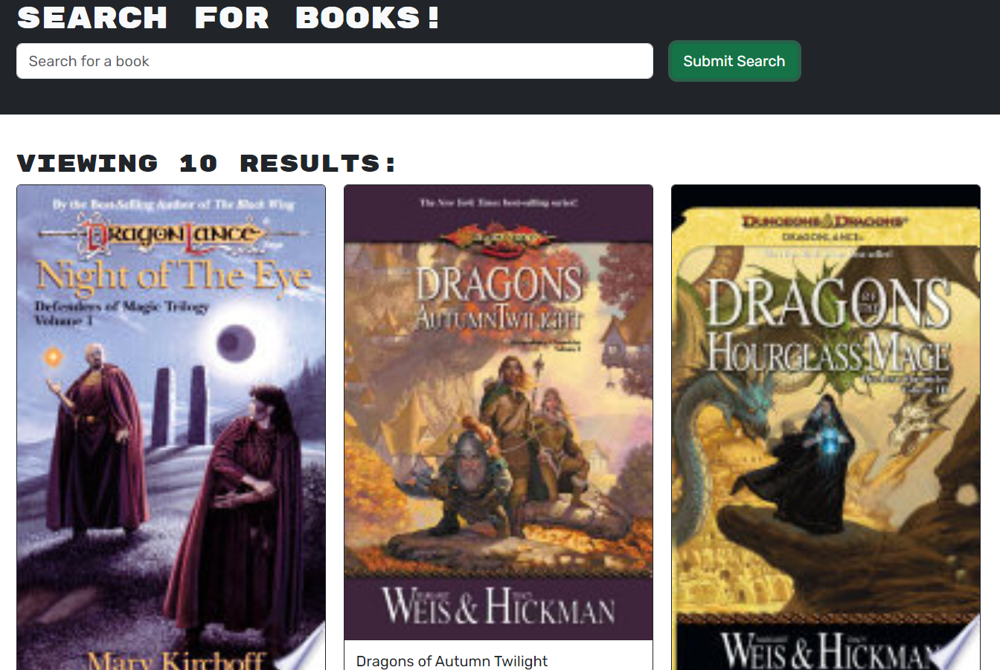

# c21-book-search-engine

## Description
  
This application allows you search Google's book api and if you register a user, you'll be able
to save these books to a reading list for yourself.
  
## Table of Contents (Optional)
  
 - [Installation](#installation)
 - [Usage](#usage)
 - [Credits](#credits)
 - [Features](#features)
 - [Questions](#questions)
  
## Installation
  
No installation needed!
  
## Usage

Click the link below and you're able to search right away! If you'd like to save books to a reading list, you'll have to login in first.

You can login or create a new user by selecting the login button in the upper right hand corner of the app.
  
To try it out, click [here](https://c21-book-search-engine-fkav.onrender.com).

Example:

  
## Credits
  
Ian Wolfe.
  
## Features
  
This project features Apollo server, bcrypt, express, graphQL, jsonwebtoken, mongoose, react, bootstrap,
vite, eslint, and hopefully I'm not forgetting anything.

## Questions

For any questions about this project, please visit my [GitHub](https://github.com/enkw).
